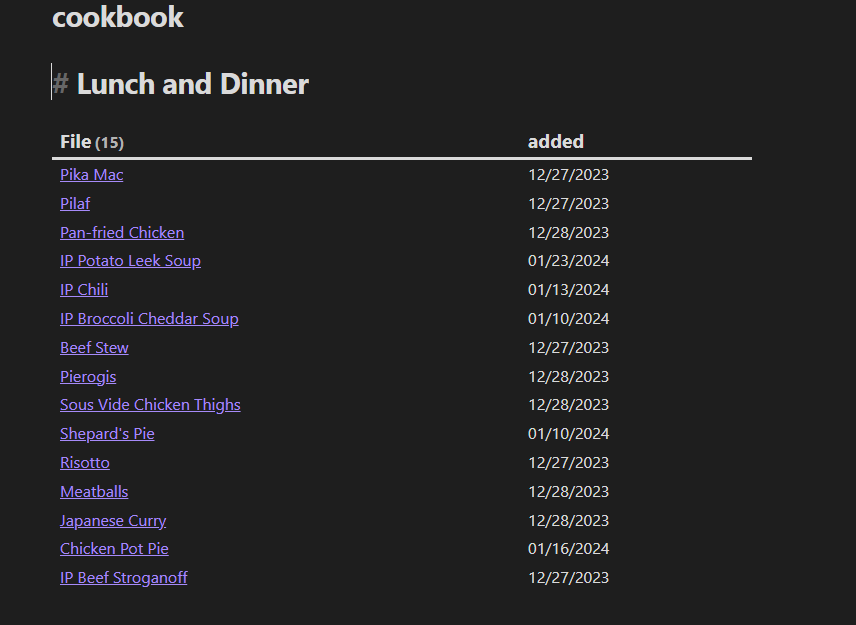

import ContentMedia from "../../components/ContentMedia.astro"
import cookbook from "../../assets/images/cookbook.png"
import lasthad from "../../assets/images/lasthadcalendar.png"
import weeklynote from "../../assets/images/weeklynote.png"
import wnsettings from "../../assets/images/wnsettings.png"

[Obsidian](https://obsidian.md) is a very powerful notes taking app that can do an absolute fuckload. It allows you to query your notes, makes you a neat lil graph of all your connected notes and just...does so much. Best Notetaking app ever. One thing I have mine set up to do is store a recipe book that creates a shopping list based on meals I have added to my weekly note, and the recipe to have a calendar that tells me the last time I made a specific thing so I don't eat the same thing every month. This is set up through several templates and with a few community plugins.

## Required Plugins

* Checklist - creates a checklist from all pages in your vault and throws it in your sidebar
* Dataview - allows querying of notes
* Periodic Notes - allows a weekly note
* Tracker - tracks occurrences within your notes

### Suggested Plugins

* Omnisearch - a bit nicer of a search for your notes. 

With that out of the way, let's get onto those templates.

# Recipe


Here is the first goal: we want a sidebar listing out the ingredients for the recipe, and the recipe with tags, where we found the recipe (in case we ever want to go back), and how many servings as the frontmatter for the `.md` file.  We also need a section for notes, a checklist for ingredients, and a spot for directions. (Ignore the `last_had` in my screenshot, I never bothered to remove it).

First, in the general settings tab for the Checklist plugin, add `#ingredients` to the list of tags for the sidebar. 

Then, create a directory for the recipes to save to, and make a new template where ever you keep your templates

This is pretty easy to set up, luckily:

```markdown
---
aliases: 
source: 
tags:
  - recipe
servings:
---
# {{title}}

>Notes:

## Ingredients
#ingredients
- [x]
---
## Directions
```

I recommend when adding ingredients to add them pre-checked. When you go to meal plan, uncheck the ingredients you don't already have and they'll populate in the sidebar with the recipe name. If they aren't pre-checked, they'll just live as Forever Tasks in your sidebar and that kinda sucks.

<ContentMedia imgSrc={lasthad.src} alt="a calendar widget displaying todays date marked in purple and a dot under a date in which i last had the recipe for beef stroganoff">

The second goal is this calendar. Today's date is highlighted and it marks the last time we had the meal -- which we will pull from our weekly notes and completed tasks, so don't worry about that yet.

</ContentMedia>

````markdown
## Last Had
```dataview
CALENDAR T.completion
FROM [[]]
FLATTEN file.tasks as T
WHERE contains(T.text, this.file.name) AND T.completion AND T.completed
```
````

Now, the whole thing together:

````markdown
---
aliases: 
source: 
tags:
  - recipe
servings: 
last_had:
---
# {{title}}

>Notes:

## Ingredients
#ingredients
- [x]
---
## Directions

## Last Had
```dataview
CALENDAR T.completion
FROM [[]]
FLATTEN file.tasks as T
WHERE contains(T.text, this.file.name) AND T.completion AND T.completed
```
````

# Weekly Note

This is pretty easy to set up, here's the end goal: 


And here is the template:

```markdown
## Weekly Tasks
#todo
- [ ] meal plan

## Meals this week
- [ ] [[Obsidian Link To Meal]]


## Notes
```

Here are my settings for the weekly note:


Now, I said the calendar is generated from the weekly note. We can do this by using Obsidian Backlinks to an added recipe, and by adding `[completion::YYYY-MM-DD]` to the line with the meal we just had after we check it off either in the tasklist or in the weekly note file itself (I never bothered automating this).

If you want to end here, you now have a functional meal planner and recipe template.

But! You can make a cookbook!



Add some headings, and then just query the tags in the recipe.

````markdown
# Lunch and Dinner

```dataview
TABLE dateformat(striptime(file.ctime),"MM/dd/yyyy") as added
FROM #recipe and -"templates" and #lunch or #dinner 
sort desc
```
````
